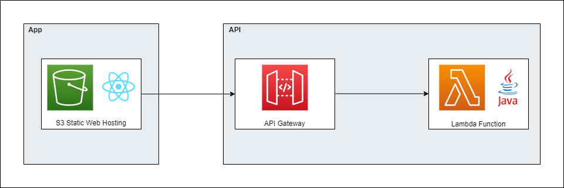

# Glass Cutting Problem


## General
Web Application that allows users to visualise how many shapes can fit on a predetermined sheet of glass. This is a subset of the knapsack problem.

Users can choose a couple of fitting algorithms, aswell as setting the order in which shapes are added.

Available to use at:

[http://glass-cutting-problem.s3-website.eu-west-2.amazonaws.com/](http://glass-cutting-problem.s3-website.eu-west-2.amazonaws.com/)

## Architecture


## Technologies
Created using:
- Java
- AWS Lambda
- Javascript
- React

## Setup
To run Lambda locally:

First, [install SAM](https://docs.aws.amazon.com/serverless-application-model/latest/developerguide/serverless-sam-cli-install.html)
 
```bash
cd GlassCuttingProblemApi
sam local start-api
```

To run React app locally:
```bash
cd glass-cutting-problem-app
echo "REACT_APP_API_ENDPOINT={your_lambda_url}" > .env
npm install
npm start
```
